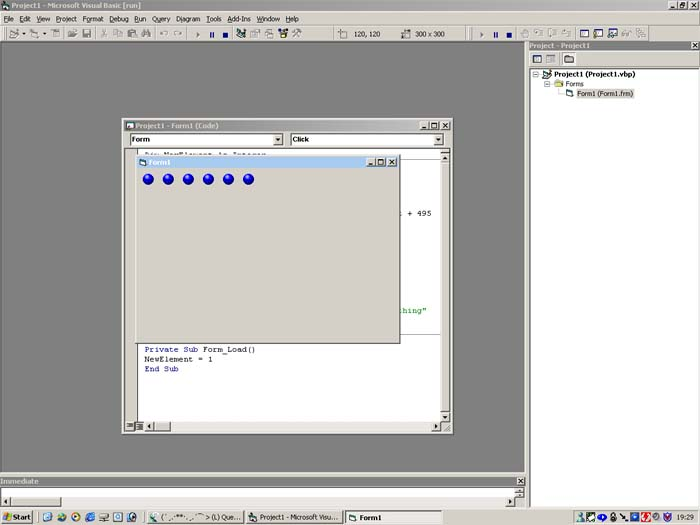



## \[\[\[ Everytime you click on form, a picture is added, unlimited\! \]\]\]

### Description

This is a more clear version of the previous post i have posted. This Code adds an image (ball) every time you click on the form, unlimited. So actually your app adds a control by itself. I know many people where looking for this code, so here it is. You can use every control, eg command buttons, textboxes, timers etc.

Greets,

Melvin
 
### More Info
 

             |
---                |---
**Submitted On**   |2002-07-04 02:12:34
**By**             |[Melvin T\.](https://github.com/Planet-Source-Code/PSCIndex/blob/master/ByAuthor/melvin-t.md)
**Level**          |Intermediate
**User Rating**    |4.0 (24 globes from 6 users)
**Compatibility**  |VB 5\.0, VB 6\.0
**Category**       |[Coding Standards](https://github.com/Planet-Source-Code/PSCIndex/blob/master/ByCategory/coding-standards__1-43.md)
**World**          |[Visual Basic](https://github.com/Planet-Source-Code/PSCIndex/blob/master/ByWorld/visual-basic.md)
**Archive File**   |[\[\[\[\_Everyt113977832002\.zip](https://github.com/Planet-Source-Code/melvin-t-everytime-you-click-on-form-a-picture-is-added-unlimited__1-37586/archive/master.zip)

